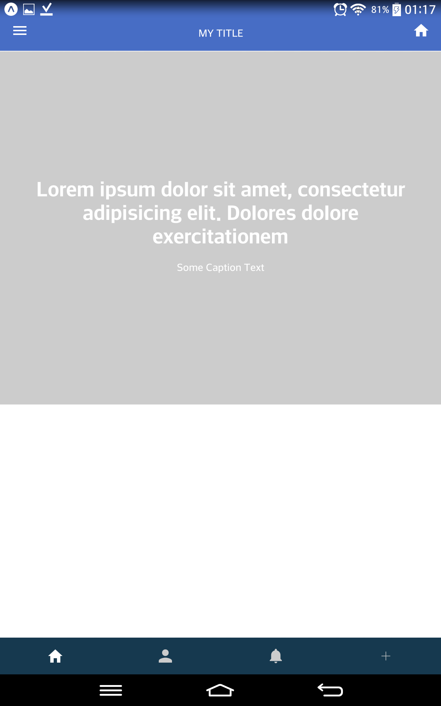
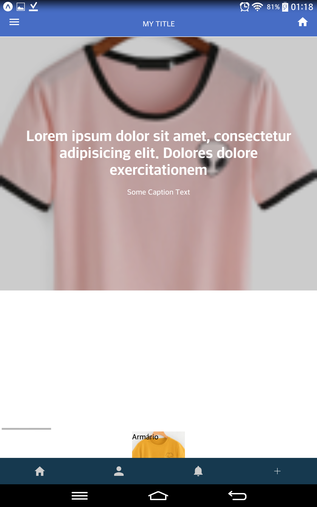
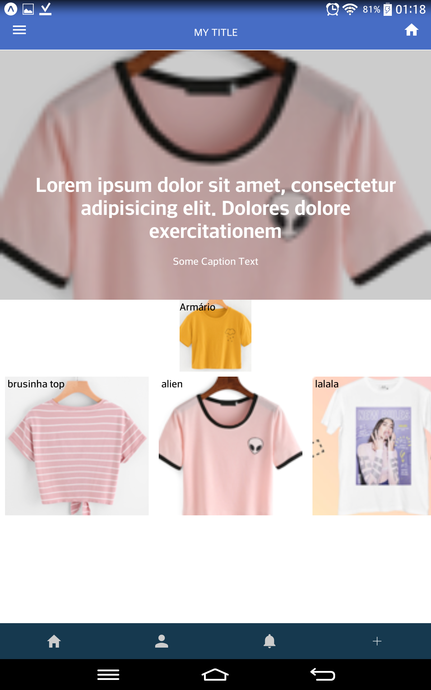

# react-interview

Aplicação realizada para entrevista de estágio.


   

## Installation

Faça o clone da aplicação. 
```shell
git clone https://github.com/andersonms1/react-interview.git
```

Navegue até a pasta correta (Bazar).
```shell
cd react-interview/Bazar
```
Instale o pacote create-react-native-app.
```shell
npm install create-react-native-app

```
Instale o pacote react-native
```shell
npm install react-native
```
Rode a aplicação. Usar o **yarn** para isso !
```shell
 yarn start
```

Tudo certo, agora basta abrir o aplicativo expo no celular que está conectado rede :smile: 


